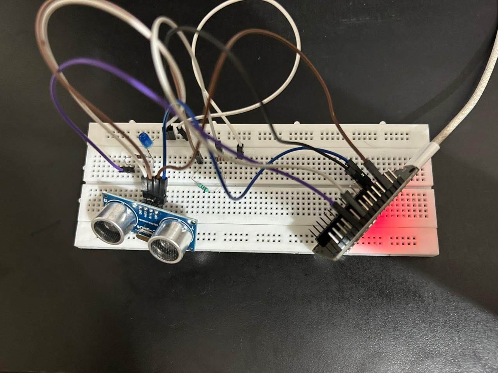
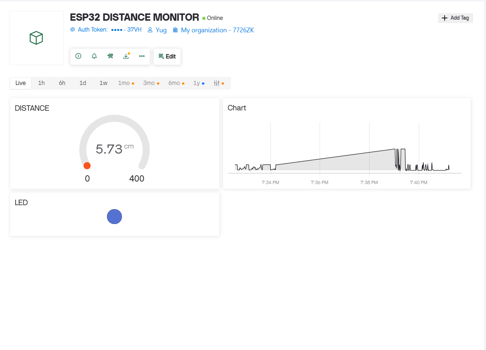
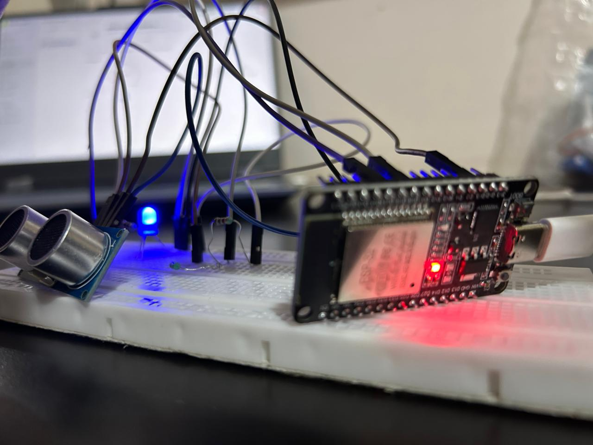

# smart-iot-distance-monitor
# Smart IoT Distance Monitoring System using ESP32

This is my IoT project using **ESP32**, **HC-SR04 ultrasonic sensor**, **LED**, and **Blynk dashboard**.

## What it does
- Measures distance in real time
- Shows live distance on Blynk dashboard
- Turns ON LED when object comes closer than 10 cm
- Displays live graph of distance

## Components Used
- ESP32
- HC-SR04 Ultrasonic Sensor
- LED
- 1k and 2k resistors (voltage divider)
- 220 ohm resistor
- Breadboard and jumper wires

## Connections
- TRIG -> GPIO 15
- ECHO -> GPIO 2 (through voltage divider)
- LED -> GPIO 21

## Dashboard
- V0 -> Distance
- V1 -> LED Status

## Project Images

### Setup

### Dashboard

### Working

